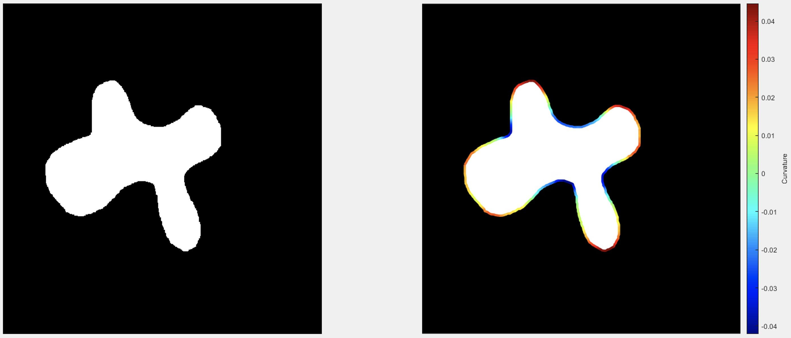
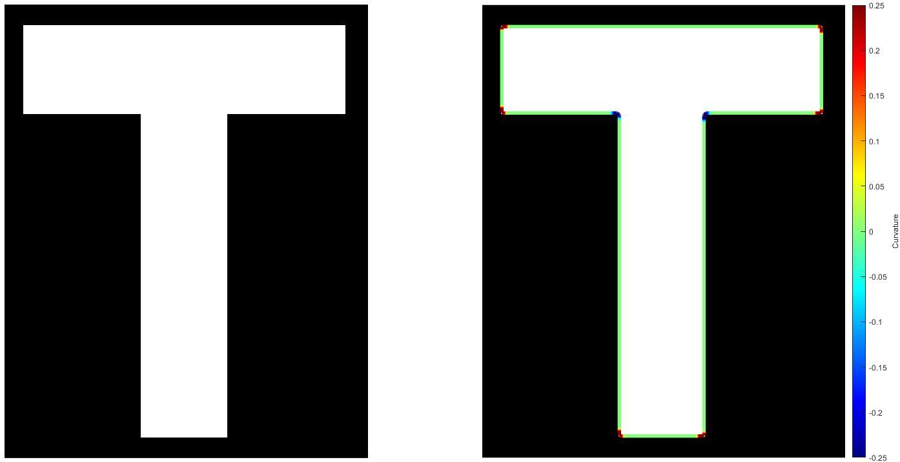

# Introduction
 

Measures the shape properties of the object boundaries and displays the curvature.

Original author: **Dr. Meghan Driscoll**  
Vectorized and compacted/concised a complicated codebase by Dr. Preetham Manjunatha.

Thanks to Dr. Meghan Driscoll who kindly shared her code for academic purpose.
If you use this code for visualization and other academic/research/any purposes. 

Please cite:

Reference:
Driscoll MK, McCann C, Kopace R, Homan T, Fourkas JT, Parent C, et al. (2012) 
Cell Shape Dynamics: From Waves to Migration. 
PLoS Comput Biol 8(3): e1002392. 
https://doi.org/10.1371/journal.pcbi.1002392

Important note: This code initially used a parfor to speed up the things. Now it has been vectorized for fast calculations.

# Quick Pipeline Visualization
## Example: Curvature visualization
| Blob |
| ------------- |
|  |

| T-section |
| ------------- |
|  |

# Requirements
MATLAB

# Feedback
Please rate and provide feedback for the further improvements.
